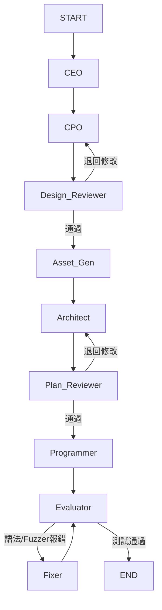

# LLM Game Generator (LangChain x Arcade)

基於 **LangChain** 與 **LangGraph** 構建的自動化多智能體 (Multi-Agent) 遊戲生成系統。
只要輸入一段遊戲靈感，系統便會透過模擬真實遊戲開發團隊（CEO、企劃、程式、測試），自動產出完整且可執行的 Python 2D 遊戲（使用 [Arcade](https://api.arcade.academy/) 框架），並自帶除錯與資產生成功能。

## 核心特色

* **LangGraph 狀態驅動工作流**：採用循環式圖形結構，支援多輪迭代、自我審查與錯誤修復。
* **多智能體協作 (Multi-Agent)**：
  * **CEO / CPO**：負責靈感分析與遊戲設計文件 (GDD) 撰寫。
  * **Architect**：規劃系統架構與檔案結構。
  * **Programmer**：結合 Cheat Sheet 與提示詞模板生成核心程式碼。
  * **Fuzzer / Fixer**：強大的自動測試與自我修復循環，將 Traceback 餵回 LLM 進行除錯直到順利運行。
* **RAG 知識增強 (ChromaDB)**：內建 Arcade 2.x 官方文件與範例知識庫，確保 LLM 生成的 API 語法正確且符合最新規範。
* **自動資產生成**：根據遊戲設計自動產出相應的圖片/精靈圖 (Sprites) 資源。

---

## 設定與環境變數 (Configuration)

本專案的核心設定皆集中於 `src/config.py`，您可以透過修改該檔案或建立 `.env` 環境變數檔來切換模型與資料庫行為。

### 1. LLM API 與模型設定
在執行生成前，必須配置您所選擇的語言模型供應商：
* `OPENAI_API_KEY`: OpenAI 密鑰（如果 `provider="openai"`）。
* `ANTHROPIC_API_KEY`: Claude 密鑰（如果使用 Claude 系列）。
* `OLLAMA_BASE_URL`: 若使用本地端模型，請設定 Ollama 伺服器位址 (預設 `http://localhost:11434`)。
* `DEFAULT_MODEL`: 設定負責推理的主力模型 (例如 `gpt-4o`, `claude-3-5-sonnet`, `llama3`)。

### 2. RAG 與 ChromaDB 設定 (`RagConfig`)
用於控制檢索增強生成 (RAG) 模組的連線模式，避免一直嘗試連線外部伺服器：
* `CHROMA_CLIENT_TYPE`: 
  * `"http"`: 連線至獨立架設的 Chroma 伺服器 (適合正式環境)。
  * `"cloud"`: 連線至 Chroma Cloud。
  * `"local"`: 直接在本地以記憶體模式運行 ChromaDB（適合開發測試）。
  * **開發提示**：若想在本地無伺服器狀態下測試，可直接在程式碼中將 Client 替換為 `EphemeralClient` (記憶體模式)。
* `CHROMA_HOST` / `CHROMA_PORT`: 本地端或遠端向量資料庫的位址與 Port。
* `ARCADE_COLLECTION_NAME`: 存放 Arcade 教學文件向量的集合名稱。
* `LLM_EMBEDDING_PROVIDER`: 設定 Embedding 來源 (例如 `"ollama"` 或 `"default"`)。

### 3. 輸出與目錄設定
* `OUTPUT_DIR`: 生成的遊戲專案 (`game.py`, `assets/`, `fuzz_logic.py`) 預設儲存路徑。
* `KNOWLEDGE_BASE_DIR`: Markdown 格式的 Arcade 官方文件與範例集存放位置。

---

## 快速開始 (Quick Start)

### 1. 安裝依賴
建議使用 `uv` 或 `pip` 建立虛擬環境：
```bash
python -m venv venv
source venv/bin/activate  # Windows 則用 venv\Scripts\activate
pip install -r requirements.txt
```

### 2. 準備 RAG 知識庫 (可選)
如果您是第一次執行，需要將 Arcade 文件向量化並存入 ChromaDB：
```bash
# 確保 ChromaDB 或 Ollama (若使用本地 Embedding) 已啟動
python -m src.rag_service.build_index
```

### 3. 啟動生成器
使用前端介面或指令列啟動遊戲生成流程：
```bash
# 啟動 Web UI
python -m src.frontend.app
```

---

## 系統架構圖 (LangGraph Workflow)



## 專案結構 (Directory Structure)

```text
LLM-Game-Generator-LangChain/
├── arcade_rag_knowledge_base/ # 存放 Arcade API 文件與範例 (Markdown)
├── src/
│   ├── config.py              # 全域設定檔 (API Keys, ChromaDB 設定)
│   ├── frontend/              # Web 介面 (app.py)
│   ├── generation/
│   │   ├── core.py            # LangGraph 工作流與 Node 邏輯核心
│   │   ├── chains.py          # 定義各個 Agent 的 Prompt Chain
│   │   ├── game_state.py      # TypedDict，管理 LangGraph 的跨節點記憶
│   │   ├── template/          # 預先寫好的通用模組 (camera, menu, asset_manager)
│   │   └── asset_gen.py       # 圖片/素材生成模組
│   ├── prompts/               # 各 Agent 的 Prompt 模板與 Math/Physics 備忘錄
│   ├── rag_service/           # ChromaDB 與 Embedding 操作封裝
│   └── testing/               # Fuzzer 與執行期沙盒測試
├── pyproject.toml             # 專案套件設定
└── requirements.txt           # 依賴清單
```

## 注意事項與已知限制
* **API 費用**：本專案包含大量的多輪對話與錯誤修復循環。使用付費 API (如 OpenAI GPT-4o) 時，長文本的生成與 Traceback 歷史傳遞可能會消耗較多 Token，建議搭配 Prompt Compression 或較便宜的模型來處理摘要。
* **資產生成**：`picture_generate.py` 需要相應的圖像生成 API (如 ComfyUI 或 OpenAI DALL-E) 權限。
